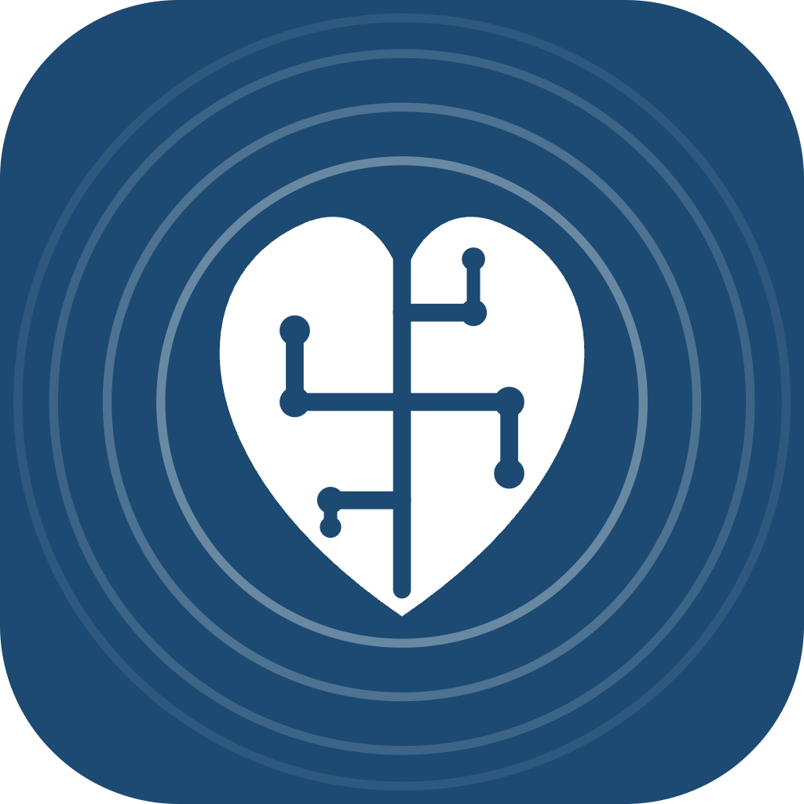
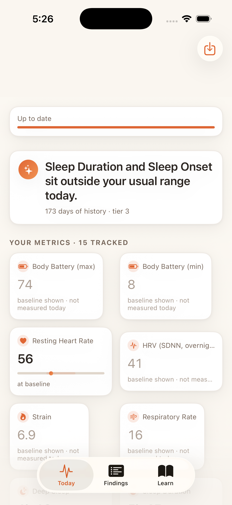
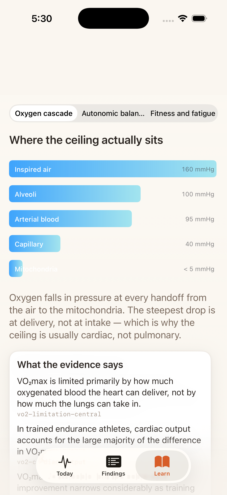
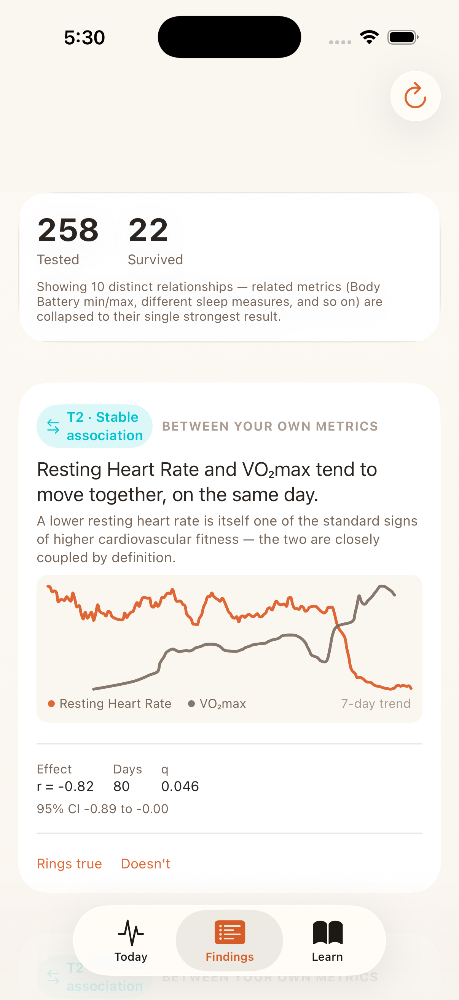
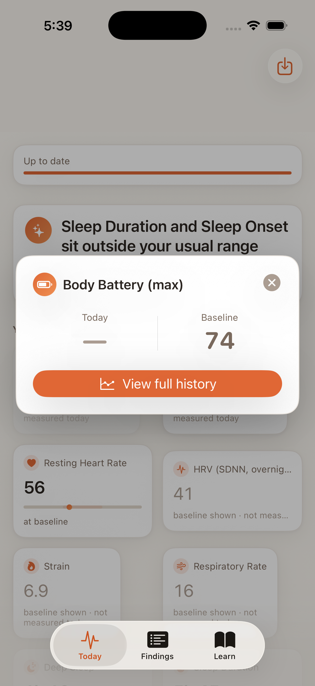

<div align="center">



# Health Engine

**Every wearable tells you *that* your HRV dropped.**
**This one tells you *why* — or says nothing at all.**


<table>
<tr>
<td width="33%"></td>
<td width="33%"></td>
<td width="33%"></td>
</tr>
<tr>
<td align="center"><sub><b>Today</b> — baselines and deviations</sub></td>
<td align="center"><sub><b>Detail</b> — today against baseline, one tap away</sub></td>
<td align="center"><sub><b>Learn</b> — every claim carries a source</sub></td>
</tr>
</table>

<sub>Real screenshots, real device, the author's own 173 days of history at tier 3. Not mockups.</sub>

</div>

---

An iOS app that turns HealthKit, Garmin, calendar, and location data into **statistically defensible statements about your own physiology.** Not another dashboard of numbers you have to interpret yourself. Not another wellness app that rounds every correlation up to a headline.

It runs entirely on your phone. No server, no account, no network call — there is no networking entitlement in the project file.

## Start here: the number that matters

Daily physiological series are strongly autocorrelated. Correlate two of them with a naive Pearson test and you will find "significant" relationships in pure noise about **a quarter of the time.** Most consumer health apps do exactly this, then put a red banner on it.

Measured on two independent AR(1) series at ρ = 0.7, n = 365 — 1,000 trials × 2,000 resamples:

| Construction | False-positive rate |
|---|---|
| Naive Pearson | **0.258** |
| Paired moving-block bootstrap, block length from the 1/e rule | 0.140 |
| Null-distribution MBB, block length from the 1/e rule | 0.152 |
| Null-distribution MBB, `L = τ_int · n^(1/3)` | **0.053** |

Getting from the first row to the last took two non-obvious corrections. The ACF 1/e rule gives L = 3 at ρ = 0.7, far too short to preserve the dependence structure — so block length comes from the Sokal-windowed integrated autocorrelation time instead, clamped to `[2, n/4]`. And inverting a paired percentile CI simply does not calibrate, so the p-value comes from a null distribution built by resampling x-blocks and y-blocks with *independent* starts. That destroys cross-dependence while preserving each series' own autocorrelation. The paired resample still produces the reported CI, which is what a CI is for.

Calibration holds across the space (600 trials each):

| ρ | n = 90 | n = 120 | n = 365 |
|---|---|---|---|
| 0.00 | 0.062 | 0.033 | 0.048 |
| 0.30 | 0.065 | 0.042 | 0.067 |
| 0.50 | 0.063 | 0.050 | 0.067 |
| 0.70 | 0.062 | 0.058 | 0.053 |
| 0.85 | **0.097** | 0.070 | 0.048 |

That 0.097 is real, and it is documented rather than hidden. Near-unit-root autocorrelation on under three months of data sits below the 90-day gate for lagged associations anyway, so nothing reaches T1 there — but it is the first thing to revisit if the minimum-N gates are ever loosened.

Power survives the correction. At n = 365, ρ = 0.7, the joint requirement (p < 0.05 **and** |r| ≥ 0.25) detects ρ = 0.3 at 75%, ρ = 0.4 at 97%, ρ = 0.5 at 100%.

Reproducible from `Health EngineTests/StatsTests.swift`. The gate runs at 500 trials in PR CI, 1,000 nightly.

### The app reports its own attrition

<div align="center">

</div>

**258 tested. 22 survived.** That number sits at the top of the Findings tab, before any result, because a scan that doesn't tell you its family size is hiding the only thing that makes its p-values interpretable. Related metrics — Body Battery min and max, several sleep measures — are collapsed to their single strongest result rather than counted as independent discoveries.

Every surviving finding carries its own effect size, day count, q-value and bootstrap CI on the card. No finding is a headline with the statistics hidden behind a chevron.

Note the example finding: resting heart rate against VO₂max, r = −0.82. The app's own rationale calls the two **closely coupled by definition** — because a lower resting heart rate is one of the standard inputs to an estimated VO₂max. Surfacing that as a stable association *and saying it's near-tautological* is the intended behaviour. An engine that can't recognise its own definitional relationships can't be trusted on the interesting ones.

## The honesty mechanism

Most health apps have exactly one epistemic mode: confident. Health Engine tags every statement with an evidence tier, and the tier is the product, not a footnote.

| Tier | What it takes | How it's phrased |
|---|---|---|
| **T0** | A day outside your rolling baseline | *"Your HRV was 12% below baseline."* |
| **T1** | BH-FDR at q = 0.10, \|r\| ≥ 0.25 floor, autocorrelation-corrected | *"These have co-occurred 9 times."* |
| **T2** | T1 + stable across two non-overlapping windows | *"These tend to move together."* |
| **T3** | T2 + temporal precedence, no identified confounder | *"This may be contributing."* |
| **T4** | A within-person randomised trial | *"In your own test, this changed X by Y."* |

Scanning 25 constructs × 20 context features × 4 lags is 2,000 tests. At α = 0.05 that is ~100 findings from noise alone — which is why the family is defined per scan and stored with every single result.

**Most findings stay at T1–T2 permanently.** Observational data cannot separate "late meetings hurt my HRV" from "days with late meetings end with a drink," and nothing in here fixes that. The ladder stops the system pretending otherwise. T4 needs an n-of-1 engine, which is roadmap.

## Missing is missing

<div align="center">

</div>

Body Battery wasn't measured today. The card shows a dash and the baseline side by side, labelled *"baseline shown · not measured today"* — not a zero, not yesterday's value quietly carried forward, not an interpolation.

This is invariant 4, enforced end to end: `value: nil` means measured-and-absent, a missing row means never observed, and `ContextService` returns no rows on permission denial rather than zeros. Imputing here would be invisible to the user and would silently corrupt every correlation downstream. It is a small UI detail and it is load-bearing.

## Architecture

```
HealthKit ──┐
EventKit  ──┼──► Store ──► Derive ──► Analyzer ──► Findings
Location  ──┤              (measurements)  (facts)      │
Garmin    ──┘                                           ▼
(optional import)                          Retrieval ──► Narrator ──► UI
                                        (bundled corpus)  (phrasing)
```

One rule holds it together: **epistemic status changes exactly once per boundary.** `Derive` produces measurements. `Analyzer` produces facts, never conclusions. `Narrator` phrases facts, never makes them. Enforced in the types, not left to convention.

```
Health Engine/
├── Health/         HealthKit, Garmin import, EventKit/CoreLocation, app-level models
├── Store/          GRDB/SQLite, append-only, dedup index, recompute orchestrator
├── Intelligence/   ACF, block bootstrap, BH-FDR, baselines, TRIMP, the scanner
├── Evidence/       BM25 + brute-force cosine retrieval, grounded on-device narration
└── UI/             SwiftUI — Today, Findings, Learn
```

### The grounding contract

An on-device LLM narrates. It does not compute, and it cannot invent a citation. Enforced in `GroundingContract.validate`, not in prompt text:

1. `@Generable` typed output — free prose confined to capped fields
2. Every numeral in the output is checked for membership in the injected fact set → fail → regenerate once → deterministic template
3. Citations are IDs selected from a provided list; the model cannot name a study
4. Below the retrieval threshold it refuses rather than generates
5. A scope classifier runs *before* retrieval — deterministic deny-list for conditions, medications, diagnostic thresholds

The third screenshot shows the payoff. Each claim under *What the evidence says* renders with its chunk ID (`vo2-limitation-central`) visible in the UI — because no claim ships in an explainer without a corresponding evidence chunk, and `ExplainerAudit` fails the test suite if any referenced ID is missing.

Apple's on-device model has a 4,096-token window covering input **and** output, and throws on overflow. The budget: 250 system / 350 facts / 750 retrieved / 200 schema / 2,000 output reserve / 550 headroom. Consequences are structural — stateless single-shot sessions, no conversation history, three chunks maximum, chunks pre-summarised into claim form at build time. Precision over recall, by force.

**The app is fully functional with the LLM disabled.** Every generated surface has a deterministic template fallback, and that path is exercised today.

## Data, tiered — nothing is ever required

| Tier | Source | Unlocks |
|---|---|---|
| 1 | **HealthKit** *(automatic)* | RHR, HRV, VO₂max, sleep stages, respiratory rate, wrist temperature → baselines, deviations, T0–T1 |
| 2 | **+ Calendar / Location** *(permission-gated)* | Meeting density, schedule shape, time away from home → context associations, T2–T3 |
| 3 | **+ Garmin import** *(manual, one-time)* | Body Battery, HRV status, training readiness, stress, longer history |

Every tier screen shows what connecting it would unlock, **computed from the real gates in `Analyzer`** rather than written by a copywriter. Analysis floors: baseline and deviation at 21 days, change point at 45, two-variable correlation at 60, lagged context association at 90. "Not enough data yet" is a designed screen, never an error state.

### What it won't claim

HRV gets no population percentile. Published references come from short supine ECG; these values come from overnight wrist PPG — different window, posture, modality, and artifact profile. Blocked in code via `Metric.permitsNormativePercentile`, not by discipline. VO₂max and RHR percentiles *are* shown, each stating its reference population and measurement method in the UI. If that can't be stated, it isn't shown.

## Stack

**SwiftUI** (no UIKit, no Storyboards) · **GRDB** — the entire store is one on-device SQLite file · **Swift Charts** · **Accelerate** for brute-force cosine, which at 200 chunks beats building an ANN index · **ZIPFoundation** against Garmin's actual GDPR export format, not a simplified stand-in · **Foundation Models** for narration, optional throughout.

## Build

```bash
git clone https://github.com/kparallel-ai/Health-Engine.git
cd Health-Engine
open "Health Engine.xcodeproj"
```

A free Apple Developer account is enough — HealthKit does not require paid enrolment, it just needs the capability registered correctly. Build to a physical device for real data; the simulator runs fine but has nothing to read.

## Status

Built against `BUILD-APP.md`; task-level detail in `BUILD-STATUS.md`.

Store, HealthKit ingest, context capture, Garmin import, derivations, statistics, analyzer, recompute, dashboard, metric detail, findings, retrieval, narrator, and explainers are **done, building, and passing tests on device.** Three things are honestly not:

| Outstanding | Why it's still open |
|---|---|
| Evidence corpus | Explainer claims are backed and audited, but the full 120–200-chunk curation pass isn't finished. It's curation labour, and it does not survive being generated. Retrieval degrades to BM25-only in the meantime and the narrator's refusal path fires correctly. |
| Strain calibration | `Strain.compressionC` and `compressionFull` are placeholders. Until they're tuned against reference days, the 6.9 on the Today screen is an internally consistent ordinal, not a comparable score. |
| CoreLocation visit persistence | Visits post on a notification; nothing holds them across launches yet. Third in the cut order — EventKit alone reaches tier 2. |

An app whose entire thesis is refusing to overclaim should not have a README that overclaims.

## Deliberately not built

| Omitted | Why |
|---|---|
| Physiological estimation from raw signal | Duplicates decades of lab-validated vendor work. Ingest converged estimates as observations. |
| n-of-1 experiment engine (true T4) | Multi-week latency per question, needs a user-supplied hypothesis. Roadmap. |
| Daily logging as a dependency | Unrealistic burden. Optional one-tap tags only. |
| A global "Recovery Score" | Rolling everything into one number is the specific intellectually dishonest step this project exists to avoid. |
| ANN vector index | 200 chunks. Brute force is faster than the index build. |
| Cloud sync, accounts, subscription | The privacy thesis *is* the product. No server also means no recurring cost. |
| 3D anatomy | Licensed assets are expensive, and a heart beating at your RHR conveys nothing the number didn't. |

Full specification: `SPEC.md`.

---

<div align="center">

*Built to say "I don't know" more often than any wellness app you've used. On purpose.*

</div>
